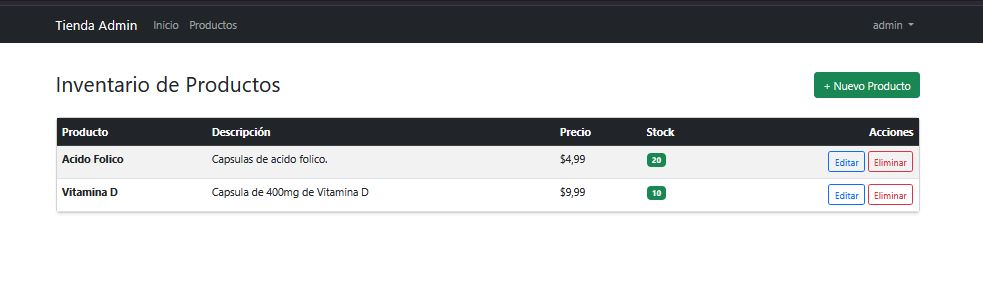
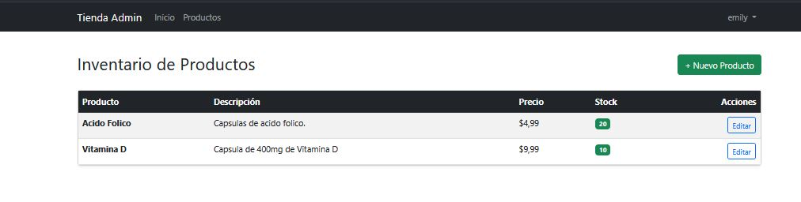

# 🛒 Plataforma de Gestión de Productos

Este proyecto es una aplicación web desarrollada con **Django** para la administración de un inventario de productos. Incluye un sistema robusto de autenticación, control de acceso basado en roles y un panel administrativo personalizado.

Proyecto desarrollado para el ejercicio individual: **Módulo 6 - AE6 - ABP**.

### Vista de Administrador

### Vista de Gestor 

## 📋 Características del proyecto

* **Gestión de Productos (CRUD):** Crear, Leer, Actualizar y Eliminar productos.
* **Autenticación de Usuarios:** Registro, Inicio de Sesión y Cierre de Sesión.
* **Roles y Permisos:**
    * **Administradores:** Control total (pueden eliminar productos).
    * **Gestores de Productos:** Pueden ver, crear y editar, pero **no eliminar**.
* **Seguridad:** Protección de rutas, manejo de errores personalizado (403, 404) y protección CSRF.
* **Interfaz Limpia:** Diseño responsivo utilizando Bootstrap 5 (sin iconos externos).
* **Automatización:** Script para la creación automática de grupos y asignación de permisos.

## ⚙️ Herramientas

* Python 3.10+
* Django
* Sqlite3